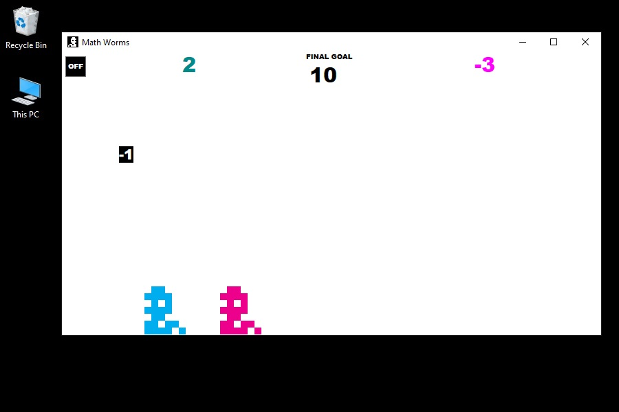
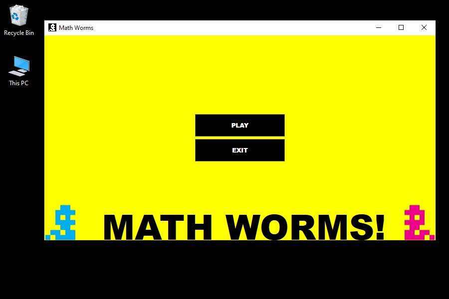

# PT_DesktopApp_GameMathWorms

## General Information

PT_DesktopApp_GameMathWorms is a personal first attempt to create a simple WPF application.

The goal of the game is to get as many targets falling from the sky as needed to match the exact randomly generated game goal score.

## Technologies

- WPF

## Sources of Information

https://docs.microsoft.com/en-us/dotnet/desktop/wpf/graphics-multimedia/how-to-animate-a-property-by-using-a-storyboard?view=netframeworkdesktop-4.8

